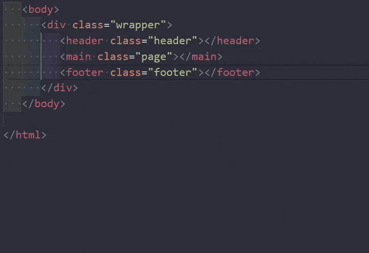
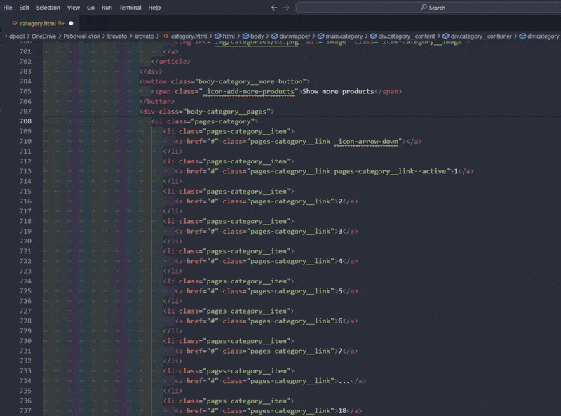

# Quick BEM Element README

Welcome to the `Quick BEM Element` extension! This extension improves your workflow by providing a fast and efficient way to work with the BEM (Block Element Modifier) methodology in Visual Studio Code. The extension allows you to quickly insert BEM elements into HTML structures, saving you time.

## What is BEM?
BEM is a methodology for creating reusable components and code sharing in front-end development. It stands for Block, Element, Modifier and helps in organizing CSS classes and HTML structure in a modular way.

## Features

- **Quick BEM Element Insertion**: Quickly insert BEM elements into your HTML. After insertion, simply provide the element's name.
- **Improved Handling of Complex Structures**: Enhanced support for complex HTML structures and ignoring icon font classes starting with `_icon-`.

## Demo

Here's a quick demonstration of the extension:

Simple structure

Complex structure

## Default Keybindings

The extension includes default keybindings that you can customize according to your preferences:

- **Insert BEM Element**: `Alt+Q`

To change these keybindings:

1. Open the Command Palette (`Ctrl+Shift+P` or `Cmd+Shift+P` on macOS).
2. Search for `Preferences: Open Keyboard Shortcuts` and select it.
3. Find the command `Quick BEM Element: Insert Element`.
4. Click on the pencil icon next to the command and set your preferred keybinding.

## Known Issues

- Ensure your HTML file has BEM blocks defined before using the command to insert elements, as the extension relies on finding these blocks.

## Reporting Issues and Requests

If you encounter any issues or have feature requests, please create an issue on [GitHub](https://github.com/PIDLISNYiDMYTRo/Quick-BEM-Element/issues).

**Enjoy!**
